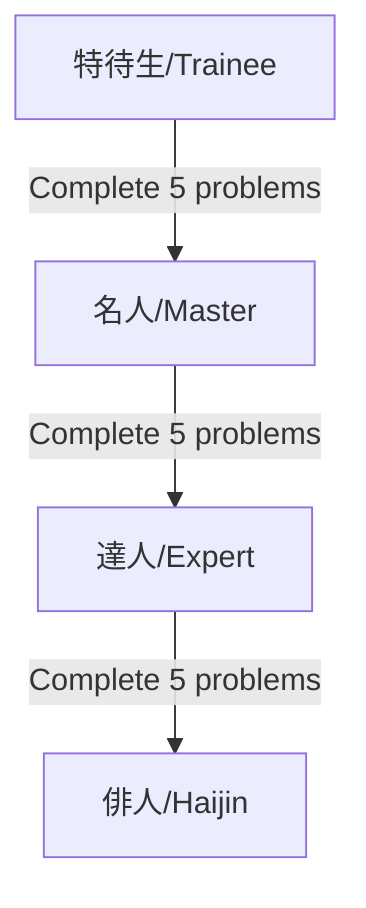
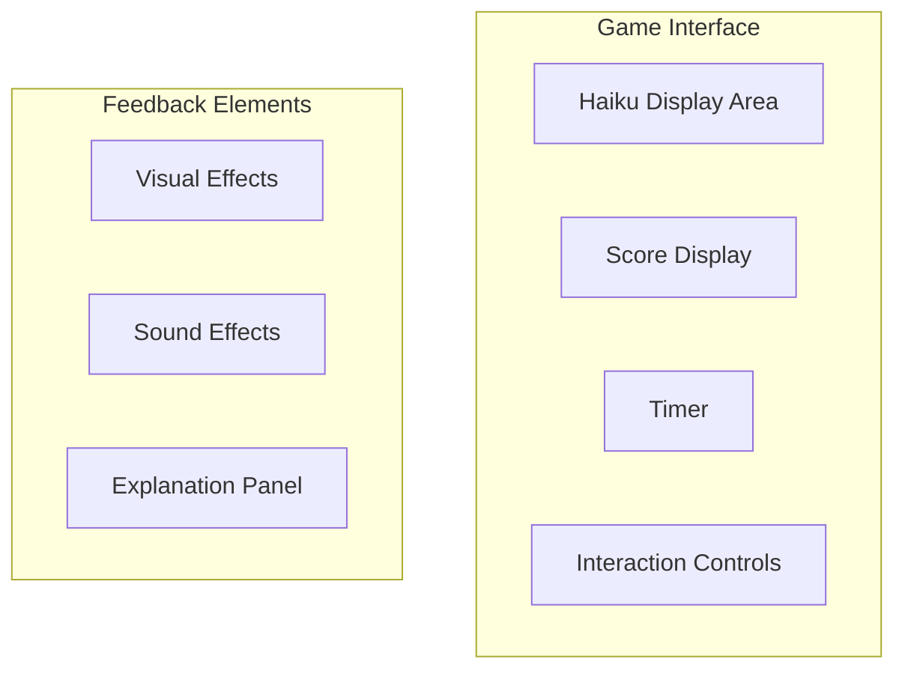

# Game Design Document

## Game Overview

bnscup_game_01 is an educational game focused on teaching players to identify seasonal references (kigo) in Japanese haiku. The game combines traditional Japanese poetry with modern gameplay mechanics to create an engaging learning experience.

## Core Game Mechanics

### 1. Haiku Presentation
- Players are presented with haiku poems in a clear, readable format
- Text is displayed using appropriate Japanese fonts
- Optional furigana (reading aids) for difficult kanji based on difficulty level

### 2. Seasonal Word (Kigo) Identification
- Players must identify the seasonal reference within the haiku
- Interactive text selection system
- Visual feedback for correct/incorrect selections
- "No Kigo" option for haiku without seasonal references

### 3. Grade System

## Progression System

### 1. Grade Levels
- **特待生 (Trainee)**
  - Entry level
  - Basic haiku with clear seasonal references
  - Furigana support available
  - 5 problems to complete

- **名人 (Master)**
  - Intermediate level
  - More complex seasonal references
  - Limited furigana support
  - 5 problems to complete

- **達人 (Expert)**
  - Advanced level
  - Subtle seasonal references
  - Minimal furigana support
  - 5 problems to complete

- **俳人 (Haijin)**
  - Ultimate achievement
  - Access to all 15 problems
  - Complete mastery of seasonal references

### 2. Scoring System
- Base points for correct identification
- Bonus points for speed
- Grade-based multipliers
- Score persistence across sessions

## Game Modes

### 1. Main Game Mode
- Sequential problem solving
- Grade-based problem selection
- Progress tracking
- Score accumulation

### 2. Tutorial/How to Play
- Accessible via F3 key
- Interactive instructions
- Basic gameplay explanation
- Example problems

## User Interface

### 1. Title Screen
- Game title display
- Grade selection (based on unlocked levels)
- Total score display
- Start game option

### 2. Game Screen

### 3. Result Screen
- Performance summary
- Score display
- Grade progression information
- Return to title option

## Audio Design

### 1. Sound Effects
- Correct answer feedback
- Incorrect answer feedback
- Menu navigation sounds
- Achievement sounds

### 2. Background Music
- Title screen theme
- Gameplay background music
- Result screen music

## Visual Design

### 1. Text Presentation
- Clear typography
- Appropriate spacing
- Optional furigana display
- Visual emphasis for selections

### 2. UI Elements
- Traditional Japanese aesthetic
- Clean, readable interface
- Consistent color scheme
- Clear feedback indicators

## Future Enhancements
(Based on future_impl.md)

### 1. Content Expansion
- Expand problem set to match 百人一首 scale
- Additional grade levels
- More varied problem types

### 2. Musical Elements
- Rhythm notation display
- Interactive rhythm elements
- Voice input features
- Traditional instrument sounds

### 3. Educational Features
- Detailed explanations
- Historical context
- Author information
- Seasonal reference guides

## Technical Requirements

### 1. Display
- Resolution: Set via config.json
- Font support: Japanese character display
- UI scaling support

### 2. Input
- Mouse interaction
- Keyboard shortcuts
- Touch support (where available)

### 3. Save Data
- Progress persistence
- Score tracking
- Grade level maintenance
- Problem completion status