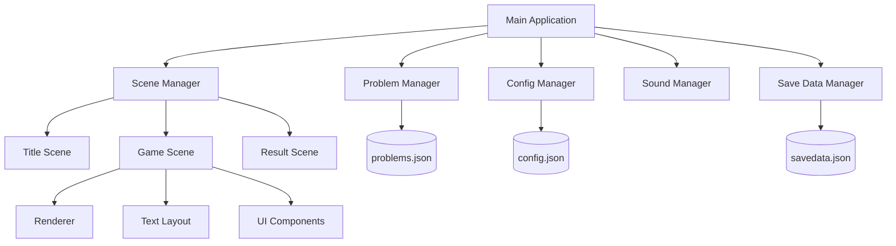

# System Architecture

## Overview

bnscup_game_01 is a game application built using the Siv3D framework that focuses on finding seasonal words (kigo) in Japanese haiku. The game features multiple difficulty levels (grades) and a progression system.

## Core Components



## Component Descriptions

### Core Management

1. **Main Application**
   - Entry point of the game
   - Initializes core systems and assets
   - Manages game loop and scene transitions

2. **Scene Manager**
   - Handles different game states (Title, Game, Result)
   - Manages scene transitions and state persistence
   - Provides shared game data across scenes

3. **Problem Manager**
   - Loads and manages haiku problems from JSON
   - Handles problem validation and verification
   - Provides problem data to game scenes

### Game Systems

1. **Config Manager**
   - Handles game configuration settings
   - Manages UI and audio settings
   - Provides configuration persistence

2. **Sound Manager**
   - Manages game audio assets
   - Handles BGM and sound effects
   - Provides audio feedback for game events

3. **Save Data Manager**
   - Handles player progress and statistics
   - Manages grade progression system
   - Provides save data persistence

### UI and Rendering

1. **Renderer**
   - Handles game visual presentation
   - Manages font assets and text rendering
   - Provides consistent UI styling

2. **Text Layout**
   - Manages text positioning and formatting
   - Handles ruby (furigana) text layout
   - Provides text animation support

3. **UI Components**
   - Implements interactive UI elements
   - Manages button states and events
   - Provides consistent UI behavior

## Data Flow

1. **Game Initialization**
   ```mermaid
   sequenceDiagram
       Main->>ConfigManager: Load Configuration
       Main->>ProblemManager: Load Problems
       Main->>SaveDataManager: Load Save Data
       Main->>SceneManager: Initialize Scenes
       SceneManager->>TitleScene: Set Initial Scene
   ```

2. **Game Progress Flow**
   ```mermaid
   sequenceDiagram
       TitleScene->>GameScene: Start Game
       GameScene->>ProblemManager: Get Problem
       GameScene->>Renderer: Display Problem
       GameScene->>ResultScene: Complete Problem
       ResultScene->>SaveDataManager: Save Progress
       Note over ResultScene,SaveDataManager: Auto-save triggers before returning to title
   ```

## File Structure

```
bnscup_game_01/
├── App/
│   ├── config.json      # Game configuration
│   ├── problems.json    # Haiku problems data
│   ├── savedata.json    # Player progress
│   ├── bgm_se/         # Audio assets
│   └── Images/         # Visual assets
├── docs/               # Documentation
└── src/               # Source code
```

## Technical Dependencies

1. **Framework**
   - Siv3D: Primary game development framework
   - Provides graphics, input, and audio capabilities

2. **Asset Requirements**
   - Font assets for text rendering
   - Sound assets for game feedback
   - Image assets for UI elements

3. **Data Storage**
   - JSON format for configuration and game data
   - Local file system for save data persistence