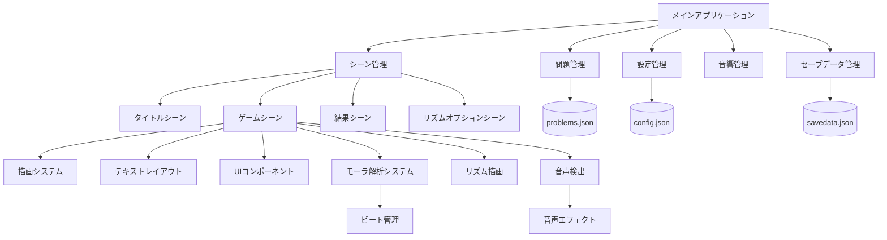

# システム設計書

## 概要

「季語シンクロ！」（bnscup_game_01）は、Siv3Dフレームワークを使用して構築された、日本の俳句における季語（きご）を見つけ出すことに焦点を当てた教育的ゲームアプリケーションです。複数の難易度レベル（段位）と進行システムを特徴とし、リズム機能と音声認識機能の拡張計画を含んでいます。

## Core Components



## コンポーネント詳細

### コア管理システム

1. **メインアプリケーション**
   - ゲームのエントリーポイント
   - コアシステムとアセットの初期化
   - ゲームループとシーン遷移の管理

2. **シーン管理**
   - 異なるゲーム状態（タイトル、ゲーム、結果、リズムオプション）の処理
   - シーン遷移と状態の永続化管理
   - シーン間での共有ゲームデータの提供

3. **問題管理（ProblemManager）**
   - JSONからの俳句問題の読み込みと管理
   - 問題の検証と妥当性確認
   - ゲームシーンへの問題データの提供
   - 段位別問題フィルタリング機能

### ゲームシステム

1. **設定管理（ConfigManager）**
   - ゲーム設定の処理
   - UIと音響設定の管理
   - 設定の永続化機能
   - リズム機能関連設定の管理

2. **音響管理（SoundManager）**
   - ゲーム音響アセットの管理
   - BGMと効果音の処理
   - ゲームイベントへの音響フィードバック
   - 音量制御とチャンネル管理

3. **セーブデータ管理（SaveDataManager）**
   - プレイヤーの進捗と統計の処理
   - 段位進行システムの管理
   - セーブデータの永続化
   - 問題クリア状況の追跡

### UI・描画システム

1. **描画システム（Renderer）**
   - ゲームビジュアルの表示処理
   - フォントアセットとテキスト描画の管理
   - 一貫したUIスタイリングの提供
   - 俳句表示とエフェクト描画

2. **テキストレイアウト（TextLayouter）**
   - テキストの配置とフォーマット管理
   - ルビ（ふりがな）テキストレイアウトの処理
   - テキストアニメーションサポート
   - 季語ハイライト機能

3. **UIコンポーネント（UiButton）**
   - インタラクティブなUI要素の実装
   - ボタン状態とイベントの管理
   - 一貫したUI動作の提供
   - スライダーとボタンスタイル管理

### 拡張機能システム

4. **モーラ解析システム（MoraSystem）**
   - 日本語音韻構造の解析
   - リズムパターンの生成
   - ビート同期処理
   - 音声認識との連携

5. **リズム描画（RhythmRenderer）**
   - リズム記譜の視覚化
   - モーラベースの描画処理
   - アニメーション制御
   - ユーザーインタラクション

6. **音声検出（VoiceDetector）**
   - リアルタイム音声活動検出
   - マイク入力処理
   - ノイズフィルタリング
   - 発声タイミング判定

## データフロー

1. **ゲーム初期化フロー**
   ```mermaid
   sequenceDiagram
       Main->>ConfigManager: 設定読み込み
       Main->>ProblemManager: 問題データ読み込み
       Main->>SaveDataManager: セーブデータ読み込み
       Main->>SoundManager: 音響アセット初期化
       Main->>SceneManager: シーン初期化
       SceneManager->>TitleScene: 初期シーン設定
   ```

2. **ゲーム進行フロー**
   ```mermaid
   sequenceDiagram
       TitleScene->>GameScene: ゲーム開始
       GameScene->>ProblemManager: 問題取得
       GameScene->>Renderer: 問題表示
       GameScene->>TextLayouter: テキストレイアウト
       Player->>GameScene: 季語選択
       GameScene->>ResultScene: 問題完了
       ResultScene->>SaveDataManager: 進捗保存
       Note over ResultScene,SaveDataManager: タイトル復帰前に自動保存
   ```

3. **リズム機能フロー（拡張）**
   ```mermaid
   sequenceDiagram
       GameScene->>MoraSystem: 俳句解析
       MoraSystem->>BeatTransport: ビート生成
       GameScene->>RhythmRenderer: リズム表示
       RhythmRenderer->>SoundManager: 音響再生
       VoiceDetector->>BeatTransport: 音声同期
       Note over VoiceDetector,BeatTransport: リアルタイム音声処理
   ```

## ファイル構造

```
bnscup_game_01/
├── App/
│   ├── config.json      # ゲーム設定
│   ├── problems.json    # 俳句問題データ
│   ├── savedata.json    # プレイヤー進捗
│   ├── bgm_se/         # 音響アセット
│   │   ├── correct1.mp3 # 正解音
│   │   ├── wrong1.mp3   # 不正解音
│   │   └── notes.wav    # リズム音
│   ├── Images/         # 画像アセット
│   │   ├── background_*.png # 背景画像
│   │   └── player_*.png     # プレイヤー画像
│   ├── Yuji_Boku/      # フォントファイル
│   └── engine/         # Siv3Dエンジンアセット
├── docs/               # ドキュメント
│   ├── 仕様書.md       # 日本語仕様書
│   ├── 使い方ガイド.md # ユーザーガイド
│   ├── system-architecture.md # システム設計書
│   ├── api-reference.md       # API参照
│   └── data-structures.md     # データ構造
└── ソースコード/
    ├── Main.cpp         # メインエントリーポイント
    ├── Config.hpp/cpp   # 設定構造体
    ├── GameScene.hpp/cpp        # メインゲームプレイ
    ├── TitleScene.hpp/cpp       # タイトル画面
    ├── ResultScene.hpp/cpp      # 結果画面
    ├── RhythmOptionScene.hpp/cpp # リズムオプション
    ├── ProblemManager.hpp/cpp   # 問題管理
    ├── SaveDataManager.hpp/cpp  # セーブデータ管理
    ├── SoundManager.hpp/cpp     # 音響管理
    ├── Renderer.hpp/cpp         # 描画システム
    ├── TextLayouter.hpp/cpp     # テキストレイアウト
    ├── UiButton.hpp/cpp         # UIコンポーネント
    ├── MoraSystem.hpp/cpp       # モーラ解析
    ├── RhythmRenderer.hpp/cpp   # リズム描画
    ├── VoiceDetector.hpp/cpp    # 音声検出
    └── GameConstants.hpp        # ゲーム定数
```

## 技術的依存関係

1. **フレームワーク**
   - Siv3D 0.6.16: 主要ゲーム開発フレームワーク
   - グラフィック、入力、音響機能の提供
   - DirectX 11 / OpenGL サポート

2. **必要アセット**
   - フォントアセット: 日本語テキスト描画用
   - 音響アセット: ゲームフィードバック用
   - 画像アセット: UI要素用
   - エンジンアセット: Siv3D標準リソース

3. **データストレージ**
   - JSON形式: 設定とゲームデータ用
   - ローカルファイルシステム: セーブデータ永続化用
   - UTF-8エンコーディング: 日本語文字サポート

4. **外部ライブラリ**
   - zstd: データ圧縮
   - SoundTouch: 音響処理（将来実装）
   - 音声認識ライブラリ（将来実装）

## パフォーマンス特性

### メモリ使用量
- 基本ゲーム: ~200MB
- 音響アセット込み: ~350MB
- 拡張機能込み: ~500MB

### レスポンス性能
- フレームレート: 60FPS目標
- 入力レスポンス: <16ms
- シーン遷移: <1秒
- ファイル読み込み: <2秒

## セキュリティ考慮事項

### データ保護
- セーブデータ検証機能
- 設定ファイル妥当性チェック
- 異常終了時の復旧機能

### 実行時安全性
- 例外安全性の確保
- メモリリーク防止
- リソース管理の自動化