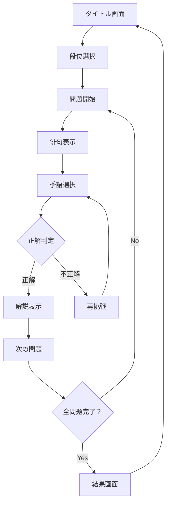

# 季語シンクロ！ 仕様書

## 1. 概要

### 1.1 プロジェクト概要
**プロジェクト名**: 季語シンクロ！（bnscup_game_01）  
**開発フレームワーク**: Siv3D  
**対象プラットフォーム**: Windows 10/11 (64bit)  
**開発言語**: C++17以降  

### 1.2 ゲームの目的
俳句に含まれる季語（きご）を見つけ出すことで、日本の伝統文学に親しみながら季節感を身につける教育的ゲームです。段位制システムにより、段階的なスキルアップが可能です。

### 1.3 ターゲット
- 小学生から大人まで幅広い年齢層
- 日本文学・俳句に興味がある方
- 教育現場での活用

## 2. ゲーム仕様

### 2.1 基本ゲームフロー



### 2.2 段位システム

| 段位 | 日本語名 | 難易度レベル | 問題数 | 昇段条件   |
| ---- | -------- | ------------ | ------ | ---------- |
| 0    | 特待生   | 初級         | 5問    | 5問クリア  |
| 1    | 名人     | 中級         | 5問    | 5問クリア  |
| 2    | 達人     | 上級         | 5問    | 5問クリア  |
| 3    | 俳人     | 最高位       | 全15問 | 全段位制覇 |

### 2.3 操作仕様

#### 2.3.1 基本操作
- **マウス操作**
  - 左クリック：季語選択、ボタン操作
  - ホバー：文字の強調表示

- **キーボード操作**
  - F3キー：ヘルプ画面の表示/非表示
  - ESCキー：ゲーム終了

#### 2.3.2 ユーザーインターフェース
- **俳句表示エリア**: 問題の俳句を表示
- **季語選択ボタン**: 「季語なし」ボタン
- **スコア表示**: 現在のスコアと段位
- **ヘルプボタン**: 遊び方の説明

### 2.4 スコアリングシステム

#### 2.4.1 基本得点
- 正解：100ポイント
- 速答ボーナス：最大50ポイント

#### 2.4.2 段位別倍率
- 特待生：1.0倍
- 名人：1.2倍
- 達人：1.5倍

## 3. 技術仕様

### 3.1 システム要件

#### 3.1.1 最小動作環境
- OS：Windows 10 64bit
- CPU：Intel Core i3相当
- メモリ：4GB RAM
- グラフィック：DirectX 11対応GPU
- ストレージ：500MB以上の空き容量

#### 3.1.2 推奨動作環境
- OS：Windows 10/11 64bit
- CPU：Intel Core i5相当
- メモリ：8GB RAM
- グラフィック：DirectX 11対応GPU（2GB VRAM）
- ストレージ：1GB以上の空き容量

### 3.2 開発環境
- **IDE**: Visual Studio 2019以降
- **ビルドシステム**: CMake 3.20以降
- **C++標準**: C++20
- **フレームワーク**: Siv3D 0.6.16
- **バージョン管理**: Git

### 3.3 アーキテクチャ概要

#### 3.3.1 主要コンポーネント
- **ConfigManager**: 設定管理
- **ProblemManager**: 問題データ管理
- **SaveDataManager**: セーブデータ管理
- **SoundManager**: 音響管理
- **Renderer**: 描画管理
- **TextLayouter**: テキストレイアウト

#### 3.3.2 シーン構成
- **TitleScene**: タイトル画面とメニュー
- **GameScene**: メインゲームプレイ
- **ResultScene**: 結果表示と統計

### 3.4 データ形式

#### 3.4.1 設定ファイル（config.json）
```json
{
  "ui": {
    "clientSizeX": 1280,
    "clientSizeY": 720,
    "wordWidth": 80,
    "lineHeightScale": 1.25
  },
  "audio": {
    "bgmVolume": 0.4,
    "seVolume": 0.8
  },
  "rhythm": {
    "bpm": 120.0,
    "rhythmModeEnabled": true
  }
}
```

#### 3.4.2 問題データ（problems.json）
```json
{
  "gameTitle": "季語シンクロ！",
  "version": "1.0",
  "problems": [
    {
      "id": "furuike_001",
      "author": "松尾芭蕉",
      "text": "古池や 蛙飛びこむ 水の音",
      "ruby": "古(ふる)池(いけ)や 蛙(かわず)飛(と)びこむ 水(みず)の音(おと)",
      "rhythm": "ふ=る=い=け=や | か=わ=ず と=び=こ=む || み=ず=の=お=と~",
      "hasKigo": true,
      "kigo": "蛙（かわず、かえる）",
      "kigoStart": 3,
      "kigoEnd": 4,
      "explanation": "静かな池に蛙（かえる）がとびこみ、*水の音だけがひびきます。",
      "tags": ["春", "有名句"],
      "grade": 0,
      "displayRuby": true
    }
  ]
}
```

## 4. 拡張機能仕様

### 4.1 リズム機能（将来実装）

#### 4.1.1 概要
俳句のリズム（音律）を視覚的・聴覚的に体験できる機能です。

#### 4.1.2 主要機能
- **リズム譜表示**: 俳句のモーラに対応したリズム記譜
- **音響再生**: 和太鼓などの伝統楽器音
- **視覚エフェクト**: リズムに同期した画面演出

#### 4.1.3 技術仕様
- **モーラ解析システム**: MoraSystemクラス
- **リズム描画**: RhythmRendererクラス
- **ビート管理**: BeatTransportクラス

### 4.2 音声認識機能（将来実装）

#### 4.2.1 概要
マイク入力による音声認識で、俳句朗読の練習が可能です。

#### 4.2.2 主要機能
- **音声活動検出**: Voice Activity Detection (VAD)
- **発声タイミング判定**: リズムとの同期判定
- **フィードバック**: 視覚的・聴覚的フィードバック

#### 4.2.3 技術仕様
- **音声検出**: VoiceActivityDetectorクラス
- **音声処理**: リアルタイム音声解析
- **判定システム**: BeatHitDetectorクラス

## 5. パフォーマンス仕様

### 5.1 パフォーマンス目標
- **フレームレート**: 60FPS（最低30FPS）
- **メモリ使用量**: 500MB以下
- **起動時間**: 5秒以内
- **レベル読み込み**: 2秒以内

### 5.2 最適化指針
- **描画最適化**: 不要な再描画の削減
- **メモリ管理**: リソースの効率的な管理
- **ファイルI/O**: 非同期読み込みの活用

## 6. 品質保証

### 6.1 テスト方針
- **単体テスト**: 各クラスの機能テスト
- **統合テスト**: シーン遷移とデータ連携
- **パフォーマンステスト**: フレームレートとメモリ使用量
- **ユーザビリティテスト**: 操作性と学習効果

### 6.2 コーディング規約
- **命名規則**: Siv3D標準に準拠
- **ファイル構成**: 機能別モジュール化
- **エラーハンドリング**: 例外安全性の確保
- **ドキュメント**: コード内コメントの充実

## 7. セキュリティと安定性

### 7.1 データ保護
- **セーブデータ**: JSON形式での保存
- **バックアップ**: 自動バックアップ機能
- **検証**: データ整合性チェック

### 7.2 エラー処理
- **ファイルアクセス**: 例外処理の実装
- **メモリ管理**: RAII原則の遵守
- **ユーザー通知**: わかりやすいエラーメッセージ

## 8. 将来の拡張計画

### 8.1 短期目標（3ヶ月）
- 段位システムの完全実装
- セーブデータ機能の強化
- ユーザーインターフェースの改善

### 8.2 中期目標（6ヶ月）
- リズム機能の基本実装
- 問題数の拡張（百人一首レベル）
- 多言語対応の検討

### 8.3 長期目標（1年）
- 音声認識機能の実装
- オンライン機能の追加
- 教育機関向け機能の強化

## 9. 法的事項

### 9.1 著作権
- **プログラム**: moqueca & Nasatame
- **音楽**: TAM Music Factory
- **俳句**: パブリックドメインまたは適切な許諾

### 9.2 ライセンス
- **フレームワーク**: Siv3D（MIT License）
- **フォント**: 各フォントのライセンスに準拠
- **サウンド**: 使用許諾範囲内での利用

---

**文書作成日**: 2025年11月2日  
**バージョン**: 1.0  
**作成者**: プロジェクトチーム  
**承認者**: 技術責任者